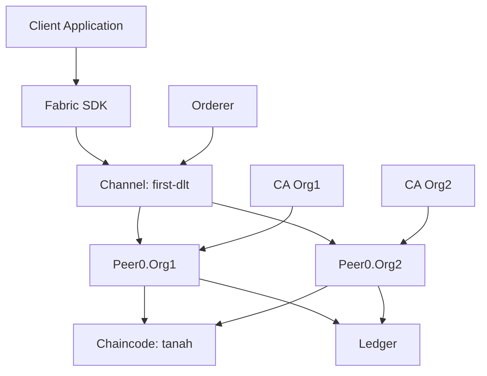
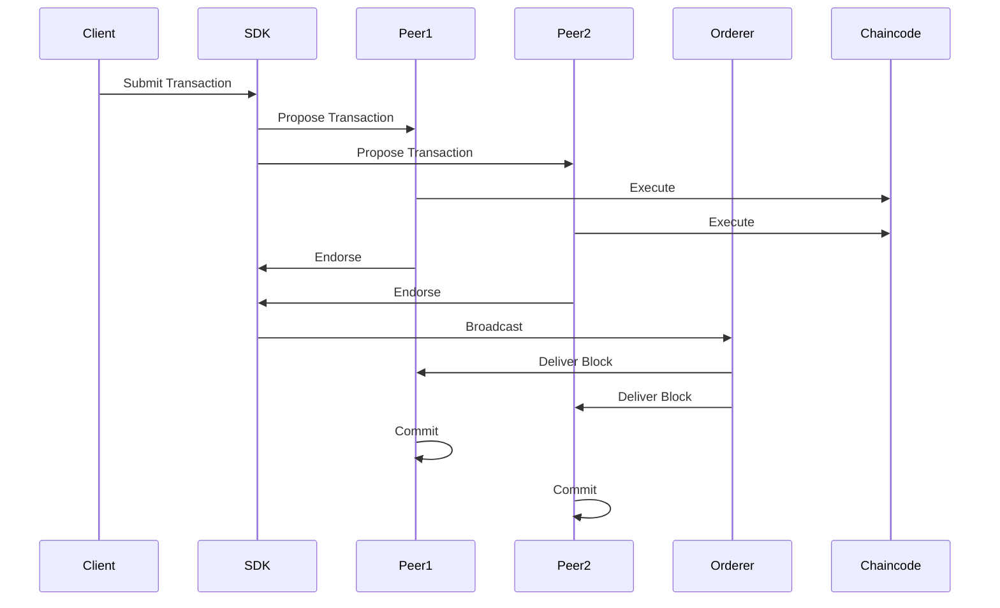

# Hyperledger Fabric Project Setup Guide

## Section 1: Installation and Setup Guide

### Prerequisites

Before you begin, ensure you have the following installed:

1. **Docker Desktop**
   - Download and install from [Docker's official website](https://www.docker.com/products/docker-desktop)
   - Make sure Docker Desktop is running before proceeding with the setup
   - Minimum requirements: 2GB RAM, 20GB free disk space

2. **Node.js and npm**
   - Install Node.js (v14 or later) from [Node.js official website](https://nodejs.org/)
   - npm will be installed automatically with Node.js
   - Verify installation:
     ```bash
     node --version
     npm --version
     ```

3. **Git**
   - Install Git from [Git's official website](https://git-scm.com/)
   - Verify installation:
     ```bash
     git --version
     ```

### Step-by-Step Installation

1. **Clone Repository**
   ```bash
   git clone <repository-url>
   cd dlt-case-hyperledger-febric
   ```

2. **Install Hyperledger Fabric**
   ```bash
   # Download and install Hyperledger Fabric
   curl -sSL https://raw.githubusercontent.com/hyperledger/fabric/main/scripts/bootstrap.sh | bash -s
   ```

3. **Setup Chaincode**
   ```bash
   # Navigate to chaincode directory
   cd chaincode/tanah

   # Initialize Node.js project
   npm init -y

   # Install required dependencies
   npm install fabric-contract-api fabric-shim
   ```

4. **Start Network**
   ```bash
   # Navigate to test network directory
   cd ../../fabric-samples/test-network

   # Start network with CA and create channel
   ./network.sh up createChannel -ca -c first-dlt
   ```

5. **Deploy Chaincode**
   ```bash
   # Deploy chaincode to the channel
   ./network.sh deployCC -ccn tanah -ccp ../chaincode/tanah -ccl javascript -c first-dlt
   ```

### Verifying Installation

1. **Check Network Status**
   ```bash
   # Check running containers
   docker ps | grep hyperledger
   ```

2. **Check Channel Status**
   ```bash
   # List channels
   ./network.sh listChannels
   ```

3. **Check Chaincode Status**
   ```bash
   # List deployed chaincodes
   ./network.sh listChaincodes
   ```

## Section 2: System Architecture

### Network Flow Diagram



### Transaction Flow



## Section 3: Important Terminology

### Distributed Ledger Technology (DLT)
Distributed Ledger Technology (DLT) is a digital system for recording transactions and their details in multiple places simultaneously. Unlike traditional databases, DLT has no central data store or administration functionality.

### Blockchain Platforms
1. **Public Blockchains**
   - Bitcoin
   - Ethereum
   - Solana

2. **Private Blockchains**
   - Hyperledger Fabric
   - Corda
   - Quorum

### Hyperledger Fabric
Hyperledger Fabric is an open-source enterprise-grade permissioned distributed ledger technology (DLT) platform, designed for use in enterprise contexts. It is the platform used in this project.

Key Features:
- Permissioned Network
- Modular Architecture
- Smart Contracts (Chaincode)
- Private Channels
- Pluggable Consensus

### Project Components
1. **Network Components**
   - Orderer: Manages transaction ordering
   - Peers: Execute and validate transactions
   - Certificate Authority (CA): Manages identities
   - Channel: Private communication layer
   - Chaincode: Smart contracts

2. **Chaincode (Smart Contract)**
   - Written in JavaScript
   - Manages land certificate data
   - Enforces business rules
   - Maintains data consistency

3. **Channel: first-dlt**
   - Private communication channel
   - Isolates transactions
   - Ensures data privacy
   - Connects multiple organizations

### Common Terms
- **DLT**: Distributed Ledger Technology
- **CA**: Certificate Authority
- **MSP**: Membership Service Provider
- **Chaincode**: Smart contract in Hyperledger Fabric
- **Channel**: Private communication layer
- **Orderer**: Transaction ordering service
- **Peer**: Network node that maintains the ledger
- **Ledger**: Record of all transactions
- **World State**: Current state of all assets
- **Endorsement**: Transaction validation process
- **Consensus**: Agreement on transaction order

## Checking Network Status

### 1. Check Running Containers
```bash
# Cek semua container yang sedang berjalan
docker ps

# Cek container Hyperledger Fabric saja
docker ps | grep hyperledger
```

### 2. Check Channel Status
```bash
# Pastikan Anda berada di direktori test-network
cd fabric-samples/test-network

# Cek channel yang sudah dibuat
./network.sh listChannels
```

### 3. Check Chaincode Status
```bash
# Cek chaincode yang sudah di-deploy
./network.sh listChaincodes
```

### 4. Check Network Logs
```bash
# Cek log untuk peer0.org1
docker logs peer0.org1.example.com

# Cek log untuk orderer
docker logs orderer.example.com
```

### 5. Common Network Status Issues

1. **Network Not Running**
   - Jika `docker ps` tidak menampilkan container Hyperledger
   - Solution: Jalankan `./network.sh up`

2. **Channel Not Created**
   - Jika `./network.sh listChannels` tidak menampilkan channel
   - Solution: Jalankan `./network.sh createChannel -c mychannel`

3. **Chaincode Not Deployed**
   - Jika `./network.sh listChaincodes` tidak menampilkan chaincode
   - Solution: Jalankan `./network.sh deployCC -ccn tanah -ccp ../chaincode/tanah -ccl javascript`

4. **Container Issues**
   - Jika container tidak berjalan dengan normal
   - Solution: 
     ```bash
     # Hentikan network
     ./network.sh down
     
     # Hapus semua container dan volume
     docker rm -f $(docker ps -aq)
     docker volume prune -f
     
     # Jalankan ulang network
     ./network.sh up
     ```

5. **Chaincode Deployment Error**
   - Error: "Could not read package.json"
   - Solution:
     - Pastikan package.json ada dengan menjalankan `npm init -y`
     - Install dependencies yang diperlukan: `npm install fabric-contract-api fabric-shim`
     - Pastikan format package.json benar
     - Coba hapus node_modules dan install ulang:
       ```bash
       cd ../chaincode/tanah
       rm -rf node_modules
       npm install
       ```

6. **npm Permission Error**
   - Error: "npm ERR! code EACCES" atau "Your cache folder contains root-owned files"
   - Solution:
     ```bash
     # Fix npm cache permissions
     sudo chown -R $USER:$(id -gn $USER) ~/.npm
     sudo chown -R $USER:$(id -gn $USER) ~/.config
     
     # Clear npm cache jika masih ada masalah
     npm cache clean --force
     
     # Coba install ulang
     npm install
     ```

## Project Structure

- `fabric-samples/`: Berisi aplikasi contoh dan test network Hyperledger Fabric
  - `chaincode/`: Direktori untuk menyimpan chaincode yang akan di-deploy
  - `test-network/`: Direktori untuk menjalankan network
- `chaincode/`: Berisi kode smart contract
  - `tanah/`: Smart contract untuk manajemen sertifikat tanah
    - `lib/`: Berisi implementasi contract
    - `index.js`: Entry point untuk chaincode
- `application/`: Berisi kode aplikasi client

## Common Issues and Solutions

1. **Docker Connection Error**
   - Error: "Cannot connect to the Docker daemon"
   - Solution: 
     - Pastikan Docker Desktop sudah berjalan
     - Restart Docker Desktop jika diperlukan
     - Periksa status Docker: `docker ps`

2. **Port Conflicts**
   - Jika ada error port conflict, pastikan tidak ada service lain yang menggunakan port yang sama
   - Port default yang digunakan:
     - 7050: Orderer
     - 7051: Peer
     - 7052: Chaincode
     - 7053: CouchDB
     - 7054: CA

3. **Permission Issues**
   - Error: "permission denied"
   - Solution:
     - Berikan permission untuk direktori: `chmod -R 755 fabric-samples`
     - Berikan permission untuk script: `chmod +x network.sh`
     - Jika masih ada masalah, coba jalankan dengan sudo: `sudo ./network.sh up`
     - Untuk macOS, pastikan Anda memiliki akses ke direktori tersebut

4. **Installation Script Error**
   - Pastikan koneksi internet stabil
   - Coba jalankan script lagi
   - Pastikan ada cukup ruang disk (minimal 20GB)
   - Periksa log untuk detail error: `docker logs <container-id>`

5. **Path Navigation Error**
   - Error: "no such file or directory"
   - Solution:
     - Gunakan path relatif (dimulai dengan ./) bukan path absolut (dimulai dengan /)
     - Contoh benar: `cd ./fabric-samples/test-network`
     - Contoh salah: `cd /fabric-samples/test-network`

6. **Chaincode Directory Error**
   - Error: "directory does not exist"
   - Solution:
     - Buat direktori chaincode di fabric-samples: `mkdir -p ../chaincode`
     - Copy chaincode ke direktori yang benar: `cp -r ../../chaincode/tanah ../chaincode/`
     - Pastikan path chaincode benar saat deploy: `-ccp ../chaincode/tanah`

## Additional Resources

- [Hyperledger Fabric Documentation](https://hyperledger-fabric.readthedocs.io/)
- [Fabric Samples Repository](https://github.com/hyperledger/fabric-samples)
- [Fabric SDK Documentation](https://hyperledger.github.io/fabric-sdk-node/)

## Support

Jika mengalami masalah atau memiliki pertanyaan:
1. Periksa [dokumentasi Hyperledger Fabric](https://hyperledger-fabric.readthedocs.io/)
2. Cari solusi di [Stack Overflow](https://stackoverflow.com/questions/tagged/hyperledger-fabric)
3. Buat issue di repository ini

## License

This project is licensed under the Apache License 2.0 - see the LICENSE file for details.